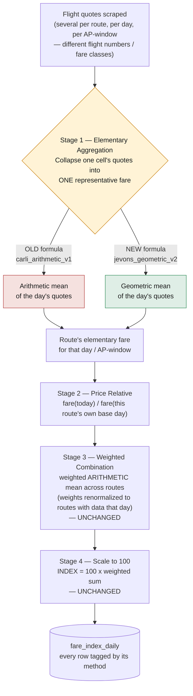
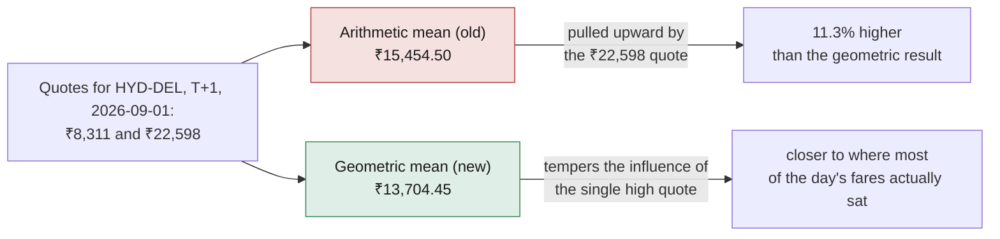
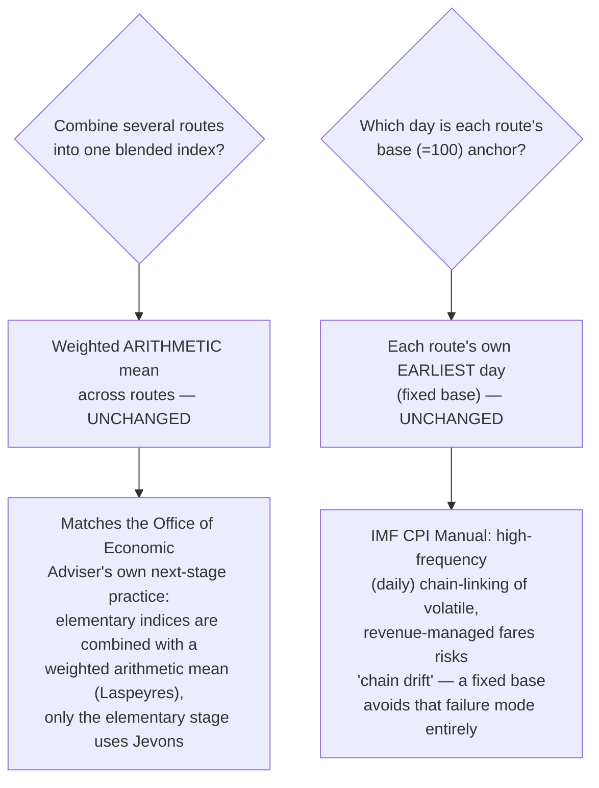
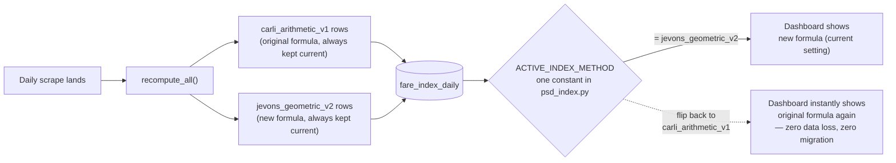
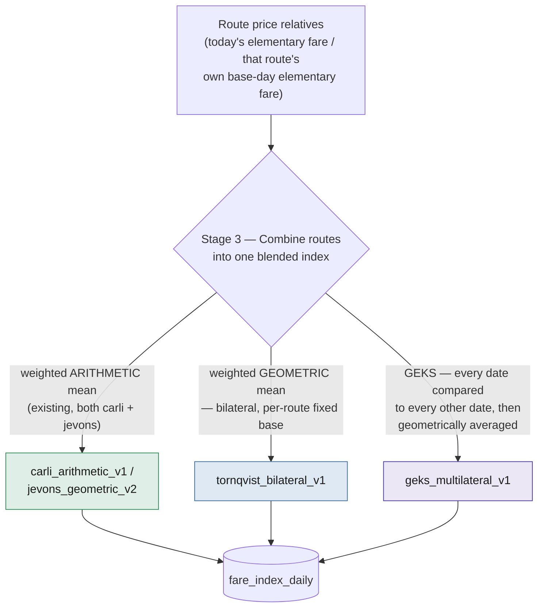

# Airfare Price Index Methodology — Carli → Jevons

This document explains, in depth, a change made to how `app/index/psd_index.py`
builds the daily Airfare Price Index: the way multiple same-day fare quotes for
one route are collapsed into a single representative fare. It covers what the
original formula did, why that formula has a documented statistical bias, what
the replacement formula does instead, and — using this project's own scraped
data, not a textbook toy example — exactly how large that bias turned out to be
in practice. It closes with the (small) trade-offs of the change and how the
old formula remains fully recoverable at any time.

**Both formulas are live in the database right now.** Nothing was deleted to
write this document; every number below was pulled from the running system.

---

## 1. Where this happens in the pipeline

The index is built in four stages. Only **one** of them changed.



Stage 1 (Elementary Aggregation) is the only stage this change touches. Stages
2–4 — the price relative, the weighted combination across routes, and the
scale-to-100 step — are identical for both formulas. Section 6 explains why
those stages were deliberately left alone.

---

## 2. The old formula: arithmetic mean (Carli-style)

When several quotes land for the same route, same day, same advance-purchase
window (e.g. three different flight numbers, or different fare buckets on the
same flight), the original code averaged them with a plain arithmetic mean:

```
elementary_fare = (fare_1 + fare_2 + ... + fare_n) / n
```

This is structurally what index-number theory calls a **Carli index** at the
elementary level — the arithmetic mean of a set of price observations for
"the same item."

### Worked example (small, for intuition)

Two quotes land for one route/day/window: **₹6,000** and **₹5,500**.

```
arithmetic mean = (6000 + 5500) / 2 = 5,750.00
```

That number by itself looks completely reasonable. The problem only shows up
once you compare it against the alternative below, and once the quotes are
more spread out than this toy pair.

---

## 3. The problem: a well-documented upward bias

### 3.1 Why it happens — AM ≥ GM

For any set of positive numbers, the **arithmetic mean is always greater than
or equal to the geometric mean** (equal only when every value is identical).
This is not specific to airfares — it's a basic mathematical inequality
(AM–GM). The more spread out the values are, the bigger that gap gets. Fare
data is exactly the kind of data where quotes ARE spread out: the same
route/day/window can carry a cheap early-bird fare class right next to a
scarce, expensive one.

### 3.2 The largest real example in our own data

Route **HYD-DEL**, AP-window **T+1**, on **2026-09-01** had exactly two quotes:



That single elementary-fare cell was **11.3% higher** under the old formula
than under the new one — purely from *which averaging formula* was used, with
the exact same two underlying quotes.

### 3.3 A second real example, with more quotes

Route **BOM-DEL**, AP-window **T+45**, on **2026-09-02** had 10 quotes:

| Quotes (₹), sorted | 4,643 | 6,593 | 7,275 | 7,401 | 7,529 | 7,529 | 7,529 | 7,708 | 8,068 | 21,139 |
|---|---|---|---|---|---|---|---|---|---|---|

| Formula | Result |
|---|---|
| Arithmetic mean (old) | **₹8,541.40** |
| Geometric mean (new) | **₹7,881.36** |
| Difference | ₹660.04 (**7.7% lower** under the new formula) |

Nine of the ten quotes cluster tightly between ₹6,593 and ₹8,068. One quote
(₹21,139) sits far outside that cluster. The old formula lets that single
quote drag the "representative fare" for the whole day up past ₹8,500 — above
*every single one* of the other nine quotes. The new formula keeps the
representative fare inside the range the vast majority of quotes actually
occupy.

### 3.4 How often this shows up across the whole dataset

Rather than relying on the two examples above, we checked every
(route, date, AP-window) cell ever collected:

| Metric | Value |
|---|---|
| Total (route, date, AP-window) cells | 481 |
| Cells with more than one quote (where the two formulas can differ at all) | 399 |
| Of those, cells where arithmetic mean > geometric mean | **366 (91.7%)** |
| Average gap `(AM − GM) / AM` across those cells | **1.21%** |
| Largest single-cell gap observed | **11.32%** (the HYD-DEL example above) |

The remaining 8.3% of multi-quote cells are ones where every quote happened to
be identical that day — the two formulas mathematically agree exactly when
there's no dispersion to correct for, which is exactly what the AM–GM
inequality predicts (equality only when all values are equal). There is no
cell anywhere in the data where the arithmetic mean came out *lower* — the
bias runs in one direction only, as the math says it must.

### 3.5 This isn't a novel finding — it's why national statistics agencies switched

This is not a quirk of this project's dataset. It's exactly why India's own
Office of the Economic Adviser (which compiles the Wholesale Price Index)
replaced this same formula:

> "In the new WPI series, elementary price index at the item level has been
> computed using the geometric mean of the price relatives (Jevons' Index) as
> opposed to the practice of taking arithmetic mean of price relatives (Carli
> Index) as was the case in the previous WPI series... for convergence of
> methods used in index compilation by the government."
> — *Manual on Wholesale Price Index (Base: 2011-12 = 100)*, Office of the
> Economic Adviser, Ministry of Commerce and Industry

The IMF's Consumer Price Index Manual reaches the same conclusion from the
axiomatic side: "most papers recommend the Jevons index rather than the Carli
index... the Jevons index is clearly the index with the best properties."

---

## 4. The new formula: geometric mean (Jevons-style)

```
elementary_fare = (fare_1 x fare_2 x ... x fare_n) ^ (1/n)
```

Computed in the database as the standard log-mean-exp identity (exact for
positive numbers, which every fare here is):

```
elementary_fare = exp( average( ln(fare_1), ln(fare_2), ..., ln(fare_n) ) )
```

Applying it to both examples above:

| Example | Arithmetic (old) | Geometric (new) | Change |
|---|---|---|---|
| HYD-DEL, T+1, 2026-09-01 (2 quotes) | ₹15,454.50 | ₹13,704.45 | −11.3% |
| BOM-DEL, T+45, 2026-09-02 (10 quotes) | ₹8,541.40 | ₹7,881.36 | −7.7% |
| Toy example (6,000 & 5,500) | ₹5,750.00 | ₹5,744.56 | −0.09% |

The correction is largest exactly where it should be — when the day's quotes
are most spread out — and nearly zero when quotes already agree closely. That
is the expected, correct behavior of a bias fix, not an arbitrary shift.

---

## 5. Effect on the published index

Both formulas are computed and stored side by side for every day so far
(`OVERALL`, the blended figure across all AP-windows):

| Date | Carli (old) | Jevons (new) | Change |
|---|---|---|---|
| 2026-09-01 | 100.0000 | 100.0000 | 0.0000 |
| 2026-09-02 | 100.6553 | 100.6518 | −0.0035 |
| 2026-09-03 | 100.9341 | 101.2762 | +0.3421 |
| 2026-09-04 | 102.3566 | 102.8139 | +0.4573 |
| 2026-09-06 | 98.8831 | 99.4019 | +0.5188 |

**Why this isn't uniformly one direction:** Section 3 shows the elementary
fare itself is never *higher* under the new formula. But the published INDEX
is a *ratio* — today's elementary fare divided by that same route's own
base-day elementary fare — and the base-day fare is *also* recomputed with the
new formula. The bias correction applies to both the numerator and the
denominator of that ratio, on whatever day each route happened to establish
its base. That's why the day-to-day index can move either up or down relative
to the old series, even though the underlying elementary fares only ever move
in one direction (down or unchanged) for a given day in isolation. This is
expected and correct — it's the same reason a bias correction applied
consistently across an entire time series doesn't just shift every point by
the same fixed amount.

---

## 6. What did *not* change, and why



Two changes were considered and deliberately **rejected**:

- **Switching route-combination to a geometric (Young-style) index** — not
  adopted, because the published WPI methodology itself keeps this stage
  arithmetic (Laspeyres-style). Matching that two-stage structure exactly,
  rather than applying a geometric mean somewhere it isn't the documented
  fix, is the more defensible choice.
- **Chain-linking each day to the previous day** instead of a fixed per-route
  base — not adopted, because this index recomputes *daily* against airline
  revenue-management fares that move for reasons unrelated to real price
  change (seat scarcity, day-of-week, promotions). The IMF's CPI Manual is
  explicit that high-frequency chaining of volatile prices "can lead to
  strong chain drift." A fixed base sidesteps that risk entirely.

---

## 7. Reversibility — both formulas exist, always

Every row in `fare_index_daily` now carries a `method` column
(`carli_arithmetic_v1` or `jevons_geometric_v2`). Recomputing the index writes
**both** series every time — the old formula's output is never overwritten,
deleted, or allowed to go stale.



- Reverting to the original formula is a **one-line config change**
  (`ACTIVE_INDEX_METHOD` in `app/index/psd_index.py`), not a data migration.
- The original series can also be inspected at any time without reverting
  anything, via `GET /index/daily?method=carli_arithmetic_v1`.
- The database migration that added the `method` column was tested in both
  directions against the live data (upgrade → downgrade → upgrade): the
  downgrade path removes only the new formula's rows and restores the
  original schema, leaving every original `carli_arithmetic_v1` row byte-for-
  byte untouched.
- 11 automated tests cover the new formula's math and this non-destructive
  guarantee specifically (`tests/test_psd_index.py`), alongside the full
  152-test project suite, all passing.

---

## 8. Minor trade-offs

For completeness, the small costs of this change:

- **Requires positive values.** A geometric mean is undefined for a
  zero-or-negative price. Not a practical concern here — every fare in this
  system is a positive currency amount by construction, and the aggregation
  query already filters out any null fare before this step runs.
- **A log/exp pass per row instead of a plain sum.** Negligible at this
  data's scale (low hundreds of rows per day); not something that shows up
  in the daily batch's runtime.
- **Twice the row count in one small table.** Keeping both formulas' series
  live means `fare_index_daily` holds two rows where it used to hold one —
  currently 60 rows total instead of 30. Trivial storage cost for the
  reversibility guarantee it buys.
- **Geometric mean is a less familiar statistic than a plain average**, so
  every row is explicitly labeled with which formula produced it (the
  `method` field) rather than leaving it implicit — addressed directly by
  this document and by the API rather than left as a silent assumption.

---

## 9. Beyond elementary aggregation: two more full index formulas

Everything above (sections 1-8) is about STAGE 1 only — collapsing several
same-day quotes for one route into one elementary fare. Two more methods have
since been added that instead change **STAGE 3**, how routes are *combined*
into one blended index — both of them still use the jevons_geometric_v2
elementary fare as their input (that question is already settled above), so
what varies here is purely the aggregation-across-routes formula. All four
methods — `carli_arithmetic_v1`, `jevons_geometric_v2`,
`tornqvist_bilateral_v1`, `geks_multilateral_v1` — are computed from the same
underlying `fare_observations` rows and kept side by side in `fare_index_daily`
exactly as sections 5 and 7 already describe; nothing about the reversibility
or non-destructiveness guarantees changes.



### 9.1 Törnqvist (bilateral): a weighted geometric mean of price relatives

Same per-route fixed-base design as jevons_geometric_v2 (each route compared
to its own earliest day — "bilateral" because it is always exactly **two**
periods being compared: today and that base day). Only the combination step
changes, from a weighted arithmetic mean to a weighted **geometric** mean:

```
ln(INDEX/100) = sum_r( w_r * ln(price_relative_r) )
```

This is the Törnqvist index (Törnqvist, 1936) — one of the two "superlative"
index formulas the IMF's CPI Manual (ch. 18) singles out as the best
second-order approximation to the true cost-of-living index. `w_r` reuses this
project's existing normalized route weights (`app/index/weights.py`) as the
expenditure-share proxy the formula calls for — the same already-documented
placeholder-weights limitation the arithmetic combination has, not a new one.

### 9.2 GEKS (multilateral): fixing an unbalanced route panel

Bilateral indices (Törnqvist above, or the original per-route-fixed-base
design) only ever compare **two** periods directly. That is fine when the same
routes report every day, but real scraped data is not always that tidy — a
route can simply have no quote on a given day (Section 3's own quote counts
show exactly this kind of gap). When the route panel differs across periods,
direct pairwise comparisons are not guaranteed to be **transitive**: comparing
day A to day C directly can disagree with going A → B → C. GEKS
(Gini–Éltető–Köves–Szulc) is the standard fix for exactly this (IMF CPI
Manual ch. 8, "Multilateral Index Number Methods"; the same method scanner-
data price statistics use for exactly this unbalanced-panel reason — see
Ivancic, Diewert & Fox, 2011):

```
ln(INDEX(t)/100) = (1/|D|) * sum_k( ln P(k,t) - ln P(k,base) )
```

where `D` is every date with data for the AP window, `base` is the single
earliest date across the whole series (one shared multilateral reference
point, unlike the per-route fixed bases the other methods use), and `P(r,s)`
is the bilateral Törnqvist index computed directly between dates `r` and `s`
using only the routes **both** dates reported a fare for. Every date is
compared against every other date, then averaged geometrically — more compute
(`O(dates²)`), but exact, not sampled, and trivially fast at this project's
data volume (see `app/index/psd_index.py`'s `compute_geks_window_index_series`
docstring). Two properties fall directly out of the formula and are covered by
`tests/test_psd_index.py`'s `GeksIndexTests`: the earliest date is always
exactly 100 regardless of which routes reported that day, and on a fully
balanced panel (every route reporting every day) GEKS collapses to exactly the
same series `tornqvist_bilateral_v1` already computes — GEKS only earns its
keep on the unbalanced days.

### 9.3 All four methods, real data, same dates as Section 5

No synthetic or estimated data was used anywhere for this — both new methods
are recomputed from the exact same `fare_observations` rows the original two
methods already use, going all the way back to day one:

| Date | Carli | Jevons | Törnqvist | GEKS |
|---|---|---|---|---|
| 2026-09-01 | 100.0000 | 100.0000 | 100.0000 | 100.0000 |
| 2026-09-02 | 100.6553 | 100.6518 | 99.7074 | 99.6212 |
| 2026-09-03 | 100.9341 | 101.2762 | 99.7803 | 99.7556 |
| 2026-09-04 | 102.3566 | 102.8139 | 100.1891 | 100.6684 |
| 2026-09-06 | 98.8831 | 99.4019 | 98.1438 | 98.8195 |

All four agree exactly on day one (100.0000 by construction) and stay within a
few points of each other thereafter — the differences are exactly what
changing only the combination formula should produce, not a discontinuity.
The dashboard's "Daily index" chart plots jevons_geometric_v2,
tornqvist_bilateral_v1 and geks_multilateral_v1 as three separate lines
(carli_arithmetic_v1 stays available via `GET /index/daily?method=carli_arithmetic_v1`
but is left off the chart as the superseded formula — see Section 4).

---

## References

- IMF, *Consumer Price Index Manual: Concepts and Methods* — Chapter 5,
  "Elementary Indices"
- IMF, *Consumer Price Index Manual: Concepts and Methods* — Chapters 6–7,
  "The Chain Drift Problem and Multilateral Indices"
- Office of the Economic Adviser (DPIIT, Ministry of Commerce and Industry),
  *Manual on Wholesale Price Index (Base: 2011-12 = 100)*
- US Bureau of Labor Statistics, *Chained Consumer Price Index for All Urban
  Consumers (C-CPI-U)*
