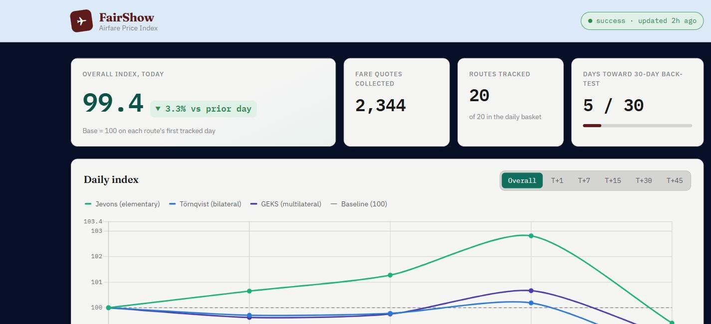
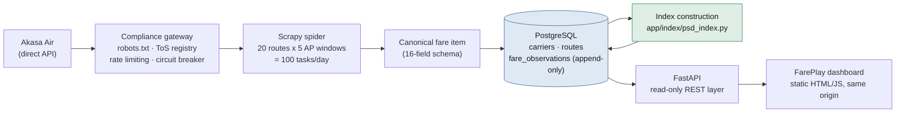

<p align="center">
  <h1 align="center">FarePlay — Airfare Price Index</h1>
  <p align="center">
    <em>An automated, high-frequency airfare price index — built to augment India's Consumer Price Index (CPI) with real fare data instead of manual, infrequent sampling.</em>
  </p>
  <p align="center">
    <strong>Submission for SIH 2026: National Airfare Price Index for CPI Augmentation (MoSPI)</strong>
    ·
    <a href="https://www.sih.gov.in/sih2026PS">Problem statement</a>
  </p>
  <p align="center">
    
    
    
    
  </p>
</p>

<p align="center">
  
</p>

---

## The problem

Over 90% of India's domestic air tickets are sold online, but the CPI's airfare component is still built from manual, infrequent price collection — and airfares themselves swing 200–400% in a single day depending on how far ahead you book. That mismatch means policymakers get a stale, low-frequency signal for one of the most volatile line items in the basket.

FarePlay closes that gap: it scrapes real fares on a fixed daily schedule, across a representative route basket and five advance-purchase windows, normalizes everything into an append-only time series, and turns it into a proper statistical price index — not a spreadsheet average.

## Architecture



One `uvicorn` process serves both the JSON API and the dashboard — no separate frontend build, no bundler.

## What's tracked

- **Routes:** 10 major Akasa-served city-pair corridors, both directions (20 routes) — DEL, BOM, BLR, HYD, CCU, MAA, PNQ and GOX. The current list lives in `app/ingestion/scheduler.py` (`ROUTE_PAIRS`); route weights in `app/index/weights.py`.
- **Advance-purchase windows:** T+1, T+7, T+15, T+30, T+45 — captures last-minute pricing through long-lead booking behavior.
- **Source:** **Akasa Air only, by deliberate design** — not a placeholder for "more sources later." The pipeline is source-agnostic by construction (`source_name`/`source_type` are just data columns), but the project scope is intentionally one well-covered source rather than several thin, harder-to-verify ones.

## The index

Four index-construction methods are computed side by side from the exact same scraped fares, and persisted per `(date, AP-window, method)` so none of them ever go stale or overwrite each other — see [`app/index/psd_index.py`](app/index/psd_index.py) and [`INDEX_METHODOLOGY.md`](INDEX_METHODOLOGY.md) for the full derivation, worked examples on this project's own data, and real numbers.

| Method | What changes | Idea |
|---|---|---|
| `carli_arithmetic_v1` | elementary aggregation | Arithmetic mean of same-day quotes (original formula; carries a documented upward bias) |
| `jevons_geometric_v2` | elementary aggregation | Geometric mean of same-day quotes — the recommended fix, matching India's own WPI methodology |
| `tornqvist_bilateral_v1` | route combination | Weighted **geometric** mean of routes' price relatives (a superlative index formula) |
| `geks_multilateral_v1` | route combination | GEKS: every date compared bilaterally against every other date, then averaged — stays consistent even when the route panel is unbalanced day to day |

The dashboard plots Jevons, Törnqvist and GEKS as three lines against a fixed 100 baseline. They can — and sometimes do — land on opposite sides of the baseline on the same day; that's a real result of arithmetic vs. geometric combination reacting differently to mixed-direction fare moves, not a bug.

## Dashboard

The FarePlay dashboard (served at `/`) is a single static page, no build step:

- **KPI strip** — today's overall index, quotes collected, routes tracked, progress toward the 30-day back-test window.
- **Daily index** — the three-method chart above, toggled by AP window.
- **Advance-purchase premium** — which routes charge the biggest last-minute markup, ranked.
- **Route table + run outcomes** — average fare by route/window, and recent scrape-run health.

## Quick start

```bash
git clone https://github.com/Salvatore1021/BananaShake
cd BananaShake

python -m venv venv && source venv/bin/activate   # Windows: venv\Scripts\activate
pip install -r requirements.txt
playwright install chromium

docker-compose up -d        # PostgreSQL
alembic upgrade head        # schema

python run_daily_scrape.py  # scrape + load one day's fares
uvicorn app.api.main:app --reload
```

Open `http://localhost:8000` for the dashboard, `http://localhost:8000/docs` for the interactive API reference.

```bash
curl "http://localhost:8000/index/daily?lead_window=OVERALL"
curl "http://localhost:8000/fares/daily-summary?route_id=DEL-BOM"
```

## Testing

```bash
python -m pytest tests/ -v
```

157 tests cover the scraper, scheduler, loader, and every index-construction formula (each with hand-derived expected values, not just smoke checks).

## Data model

Three normalized tables — `carriers` and `routes` (dimensions), `fare_observations` (an **append-only** fact table: the same flight quoted at two different scrape times is two rows, never an update-in-place, since the whole point is charting how a fare moves). `fare_index_daily` holds the precomputed index series. [`app/db/models.py`](app/db/models.py) is the single source of truth — Alembic migrations are autogenerated from it.

## Compliance

| Layer | Mechanism |
|---|---|
| Legal | Explicit ToS registry per source; default is "pending" (conservative) |
| Technical | Live robots.txt fetch with TTL cache; fails closed if unreachable |
| Behavioral | Circuit breaker — stops hammering a domain that says no |
| Pace | 2.5s delay + jitter, autothrottle, one concurrent request per domain |
| Transparency | Every row carries `source_name`, `source_type`, `scraped_at` |
| Privacy | No PII, no passenger data, no user tracking — fare quotes only |

## Tech stack

| Layer | Technology |
|---|---|
| Scraping | Scrapy + Playwright (Chromium), Protego for robots.txt |
| Database | PostgreSQL 16, SQLAlchemy 2.0, Alembic |
| API | FastAPI + Uvicorn |
| Scheduling | APScheduler |
| Dashboard | Static HTML/CSS/JS + Chart.js (no build step) |

## Contributing

Fork, branch, add tests for what you change, and open a PR — `python -m pytest tests/` should stay green.

---

<p align="center">
  <em>Transparent. Auditable. High-frequency.</em> — built for NSO, RBI, and the Ministry of Statistics & Programme Implementation.
</p>
